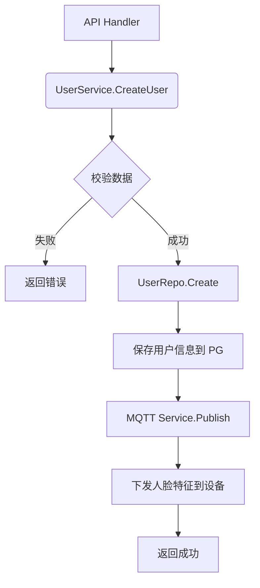

在 Service 层（业务逻辑层），你需要将 Repository 层的“原子操作”组合成具体的“业务场景”。

对于智能门禁系统，Service 层不仅要处理数据流转，还要负责**硬件交互（通过 MQTT）**、**安全校验**和**复杂逻辑判断**。

基于你的架构（Gin + EMQX + PostgreSQL），以下是 Service 层应该包含的核心功能模块及详细设计：

### 🛡️ 1. 门禁控制服务
这是系统的核心，负责处理“开门”这一动作的完整生命周期。

#### 核心功能
- **远程开门**：管理员在后台点击开门。
    - *逻辑*：校验管理员权限 -> 记录操作日志 -> 通过 MQTT 发布开锁指令 -> 更新设备状态。
- **通行记录处理**：接收设备上报的通行结果。
    - *逻辑*：解析 MQTT 消息 -> 调用 LogRepo 写入数据库 -> 如果开门成功，触发后续逻辑（如考勤计算）。
- **实时状态监控**：
    - *逻辑*：处理设备的心跳包，更新 Redis 中的设备在线状态，若长时间无心跳则标记为离线。

#### 代码示例
```go
type AccessService struct {
    logRepo      repository.AccessLogRepository
    deviceRepo   repository.DeviceRepository
    mqttClient   mqtt.Client // 注入 MQTT 客户端
}

// 远程开门
func (s *AccessService) RemoteUnlock(ctx context.Context, adminID, deviceID string) error {
    // 1. 检查设备是否在线 (可选，依赖 Redis 或 DB)
    // 2. 发布 MQTT 指令
    topic := fmt.Sprintf("device/%s/cmd", deviceID)
    payload := `{"action": "unlock", "source": "admin", "admin_id": "` + adminID + `"}`
    if token := s.mqttClient.Publish(topic, 1, false, payload); token.Wait() && token.Error() != nil {
        return token.Error()
    }
    // 3. 记录后台操作日志
    return s.logRepo.Create(ctx, &model.AccessLog{
        UserID: adminID, DeviceID: deviceID, AuthMethod: "remote", Result: "success",
    })
}
```

### 👥 2. 用户与权限服务
负责管理“谁能进哪扇门”，这是最复杂的逻辑部分。

#### 核心功能
- **人员录入与下发**：
    - *逻辑*：保存用户信息（含人脸特征）到 DB -> **调用 MQTT 将特征值下发到指定设备**（确保设备端也有权限库）。
- **权限变更**：
    - *逻辑*：更新 DB 中的 `allowed_devices` (JSONB) -> 通知相关设备更新本地权限列表。
- **通行权限校验**（如果是服务端鉴权模式）：
    - *逻辑*：接收设备发来的“识别请求” -> 查询 DB 比对特征值 -> 查询权限表 -> 返回“允许/拒绝”。

#### 关键点
- **数据一致性**：确保数据库里的权限和设备本地缓存的权限是同步的（通过 MQTT 消息同步）。

### 📊 3. 统计与报表服务
基于海量的通行日志，为前端大屏或管理员提供数据支持。

#### 核心功能
- **考勤统计**：
    - *逻辑*：根据 `access_logs` 表，计算某用户当天的“最早进入时间”和“最晚离开时间”。
- **通行趋势分析**：
    - *逻辑*：统计某设备在过去 24 小时的通行流量（需使用 SQL 的 `GROUP BY` 时间窗口）。
- **异常行为分析**：
    - *逻辑*：查询短时间内连续失败的记录（可能是暴力破解或非法闯入）。

### 📱 4. 访客服务
处理临时人员的通行需求。

#### 核心功能
- **访客预约**：生成临时二维码或临时密码。
- **临时权限激活**：
    - *逻辑*：在访客到达前，在 DB 中插入一条带有 `有效期` 的权限记录 -> 下发给设备。
- **权限自动失效**：
    - *逻辑*：配合定时任务（如 `go-co-op/gocron`），在过期时间到达时自动删除或禁用该权限。

### 🏗️ Service 层架构示意图

为了让你更清晰地理解，这里展示一个典型的 Service 层方法调用流程（以“用户录入”为例）：



### 📌 总结：Service 层职责清单

| 模块 | 关键方法名示例 | 职责描述 |
| :--- | :--- | :--- |
| **AuthService** | `Login`, `RefreshToken` | 管理员登录，JWT 签发 |
| **UserService** | `AddUser`, `UpdatePermission`, `SyncToDevice` | 用户增删改查，**权限同步到硬件** |
| **AccessService** | `HandleDeviceReport`, `RemoteUnlock` | 处理通行上报，远程开锁指令下发 |
| **DeviceService** | `RegisterDevice`, `UpdateHeartbeat` | 设备注册，心跳维护，状态管理 |
| **ReportService** | `GetDailyStats`, `GetAttendance` | 考勤计算，流量统计，图表数据聚合 |

**核心原则**：
Controller 层只负责参数校验和返回 JSON，Repository 层只负责 SQL 增删改查，**所有的“业务规则”（如：开门需要下发指令、权限需要跨表校验）都必须写在 Service 层。**